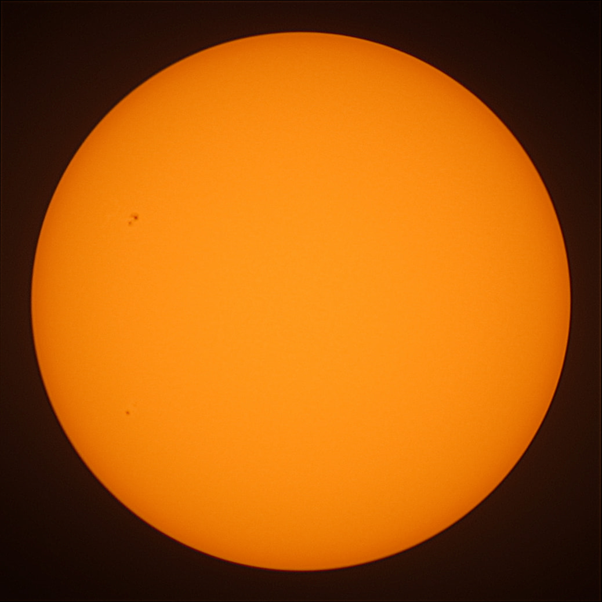
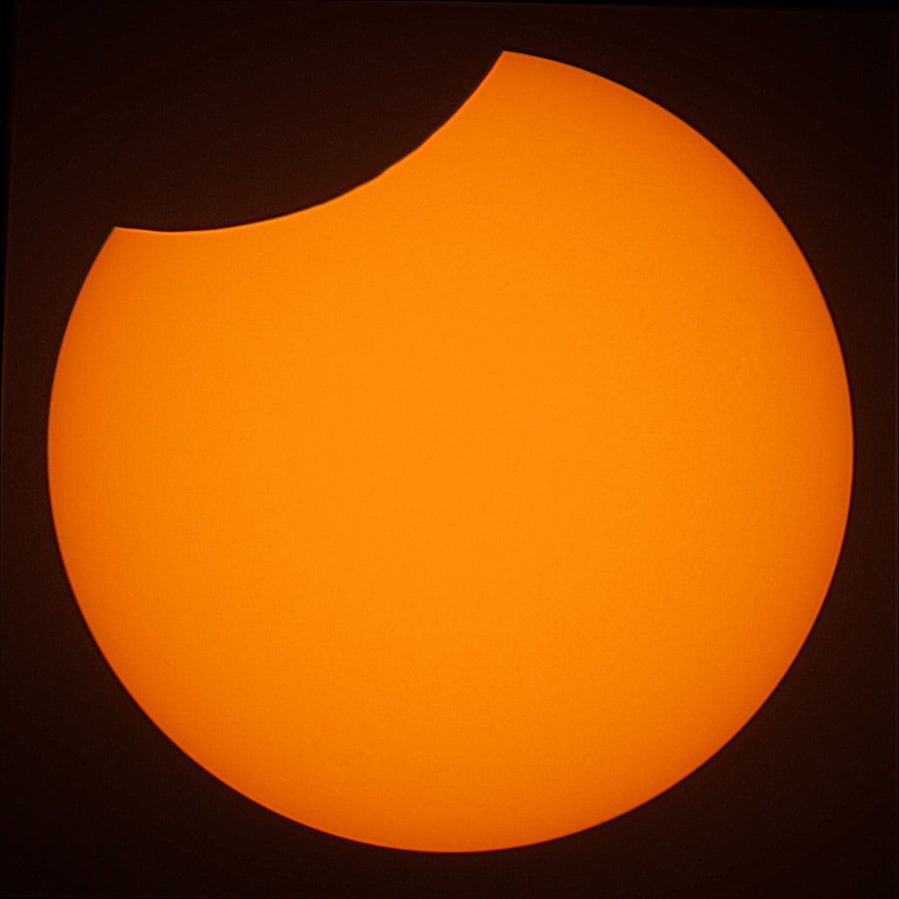
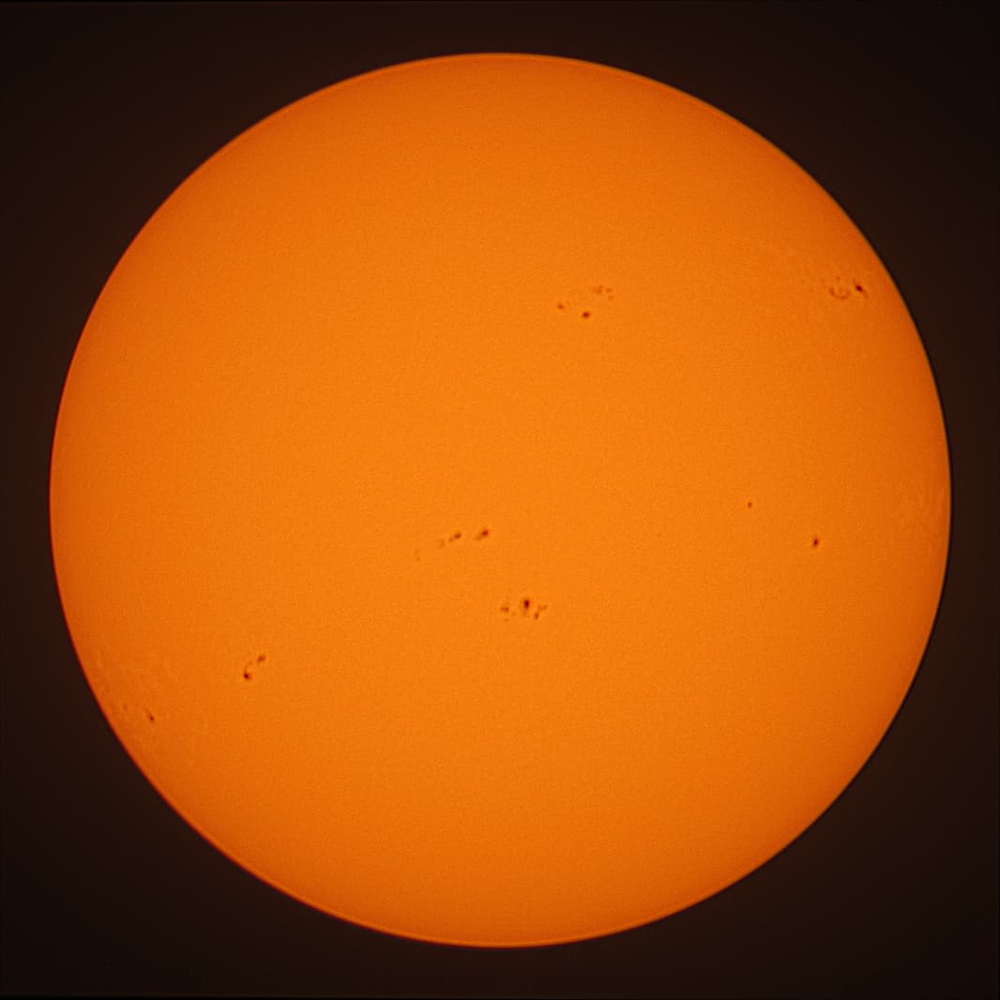
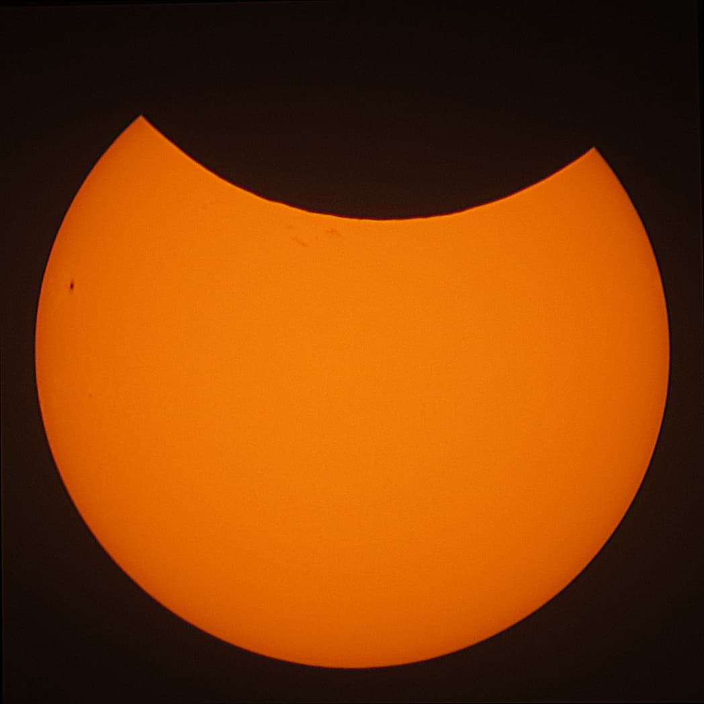

# wolfdotsolar
Solar Observation Processing Pipeline

## 1. Build Docker Image (optional)
```bash
docker build -t isontheline/wolfdotsolar:edge .
```

## 2. Launch Crop & Stack Pipeline
```bash
docker run --rm -v /folder/with/sun/pictures/:/imgs isontheline/wolfdotsolar:edge cropnstack "/imgs/*.JPG"
```

## 2.1. Optional parameters
| Parameter Name | Parameter Value | Description | Example |
| --- | --- | --- | --- |
| timezone | A valid timezone string | Ability to define the timezone | `--timezone="Europe/Paris"` |
| pimask | Boolean | Create a [Pixinsight](https://pixinsight.com/) [mask](https://pixinsight.com.ar/en/results.html?q=mask) about the Solar limb | `--pimask=true` |

## 3. Examples of Results
| Sunspots May 10, 2021 | Partial Solar Eclipse June 10, 2021 | Sunspots September 5, 2021 | Sunspots December 31, 2024 | Partial Solar Eclipse March 29, 2025 |
| --- | --- | --- | --- | --- |
|  |  |  |  |  |

# Wolf.Solar
Wolf.Solar is a continuous monitoring tool for solar activity. [Publish](https://wolf.solar) your observations and share them with the community